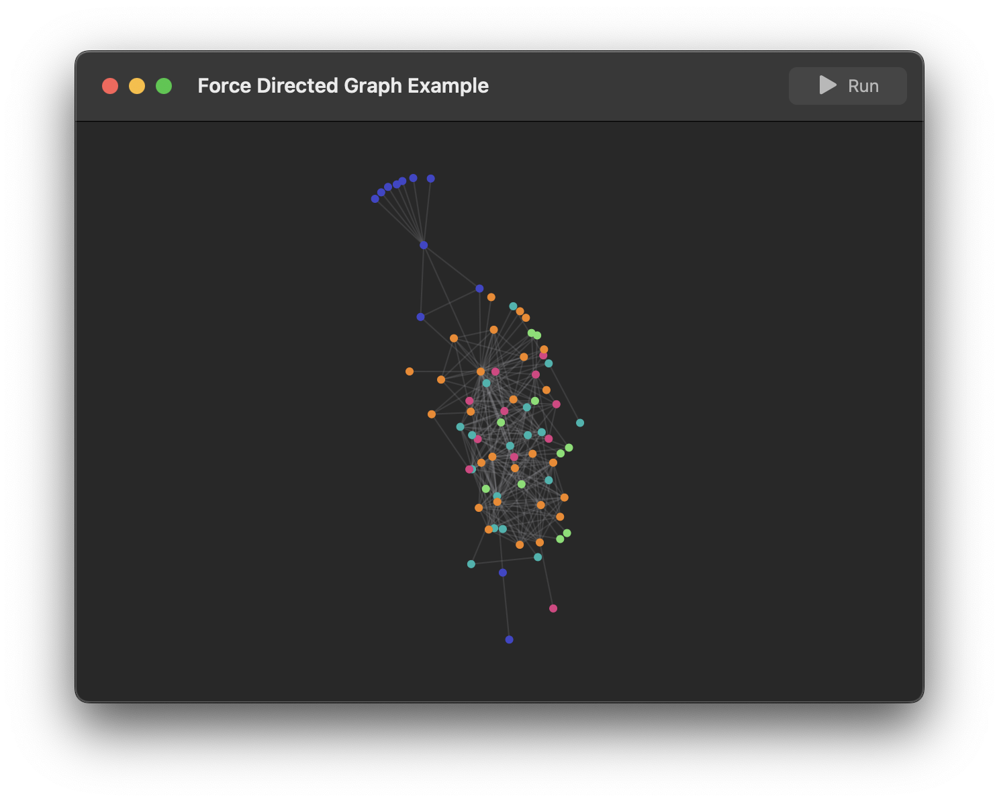

# Grape

A visualization-purposed force simulation library that behaves like d3-force.

### Examples

This is a force directed graph visualizing the data from [Force Directed Graph Component](https://observablehq.com/@d3/force-directed-graph-component), running at 120FPS on a SwiftUI Canvas.

### Features

| Feature | Status |
| --- | --- |
| LinkForce | ✅ |
| ManyBodyForce | ✅ |
| CenterForce | ✅ |
| CollisionForce |  |
| PositionForce |  |
| RadialForce |  |
